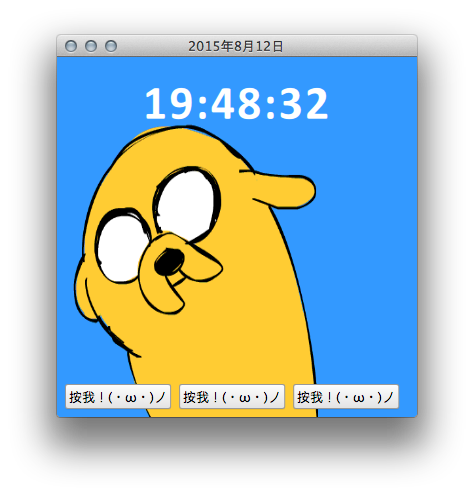

tutorial-workshop-clock
=======================

這是[臺灣大學開源社](https://ntuosc.org) 2015 人文青年暑期工作坊課程中逐步演練實作的範例程式。

於 Qt 5.5.0 環境底下編譯，以 [MIT License](LICENSE.md) 釋出供公眾利用。

有著作權的素材表列[於此](COPYRIGHT.md)。

---

Example QML app of 2015 NTUOSC Humanities Workshop.

Released under [MIT License](LICENSE.md), copyrighted materials are enlisted [here](COPYRIGHT.md).
